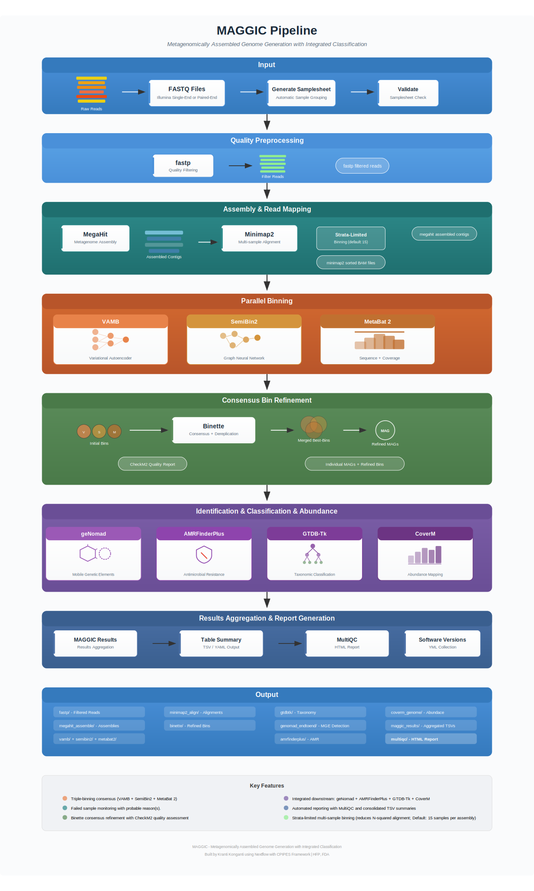

# MAGGIC

MAGGIC (**M**etagenomically **A**ssembled **G**enome **G**eneration with **I**ntegrated **C**lassification) is an automated workflow for the generation and refinement of Metagenome-Assembled Genomes (MAGs) from metagenomic sequencing data.

It integrates multiple binning algorithms (`VAMB`, `SemiBin2`, `MetaBat 2`) followed by consensus-based bin refinement with `Binette`, taxonomic classification with `GTDB-Tk`, mobile genetic element detection with `geNomad`, and antimicrobial resistance gene profiling with `AMRFinderPlus`.

## Contents

- [1. Installation Requirements](Installation-Requirements)
- [2. Database Requirements](Database-Requirements)
- [3. Usage Examples](Usage-Examples)
  - [3.1. Multi-Sample Binning](Multi-Sample-Binning)
  - [3.2. CLI Reference](CLI-Reference)
- [4. Results Overview](Results-Overview)
  - [4.1. Bin Classification](Bin-Classification)
  - [4.2. Plasmid & Virus Metrics](Plasmid-Virus-Metrics)
  - [4.3. AMR Profiling](AMR-Profiling)
  - [4.4. MAGGIC Plots](MAGGIC-Plots)
- [5. Future Roadmap](#future-roadmap)

## Future Roadmap

- 06/04/2026: Will address BAM low depth issues in later versions. <1% mapped && <100K reads && <5000 contigs will be filtered out.
