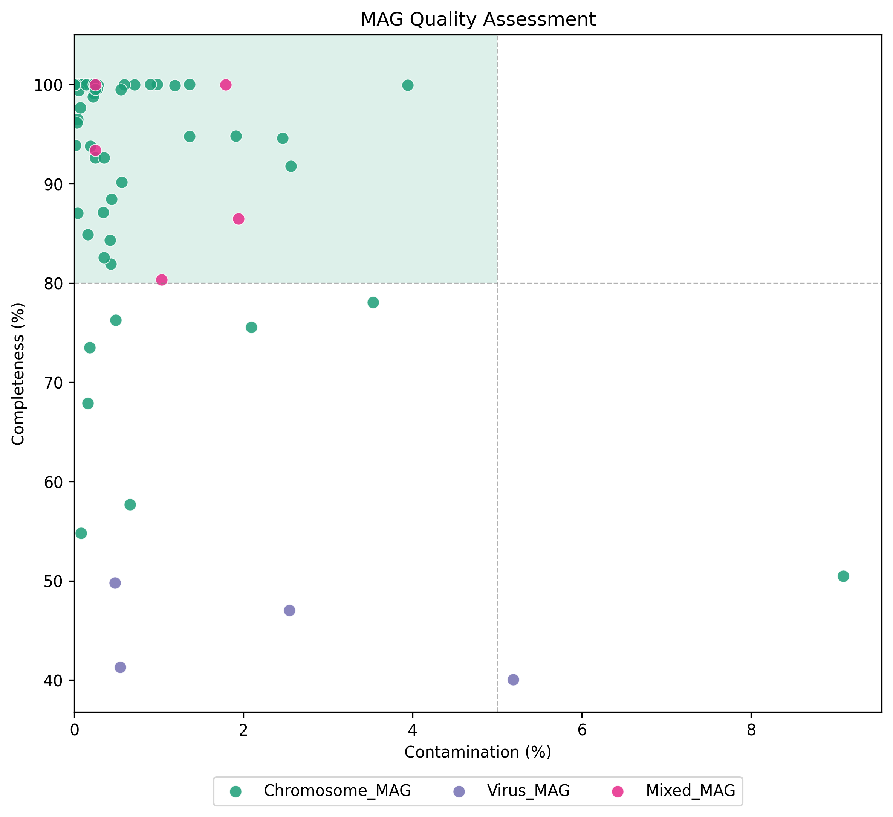
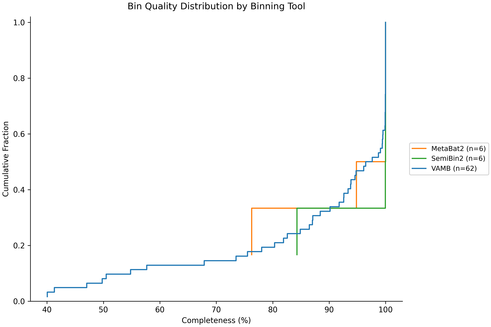
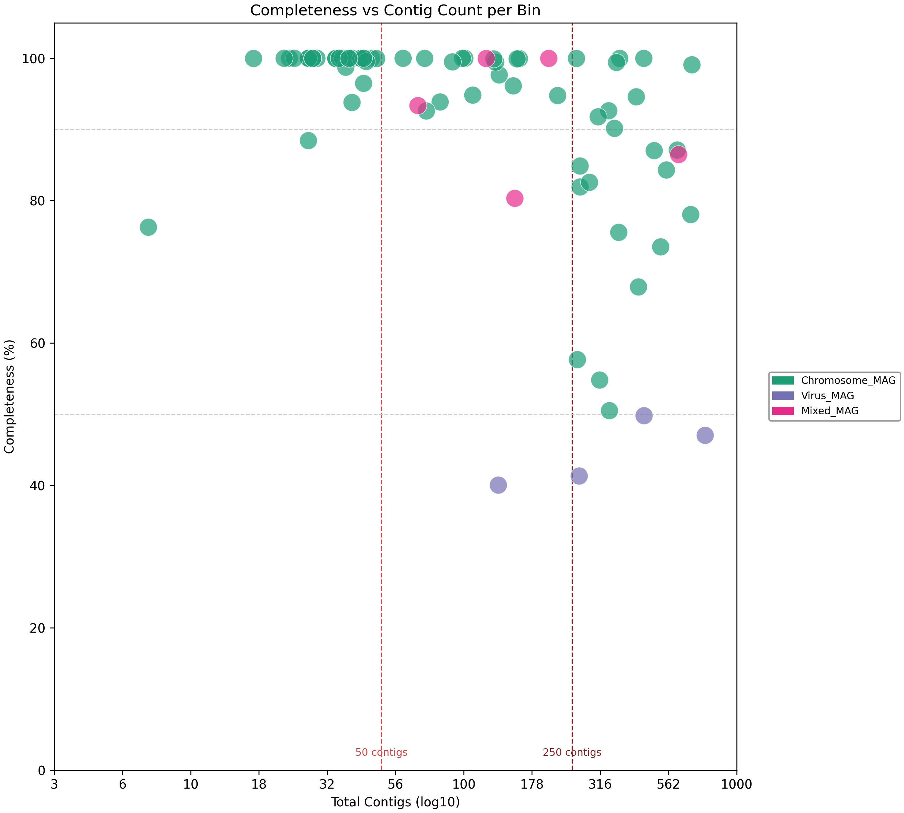
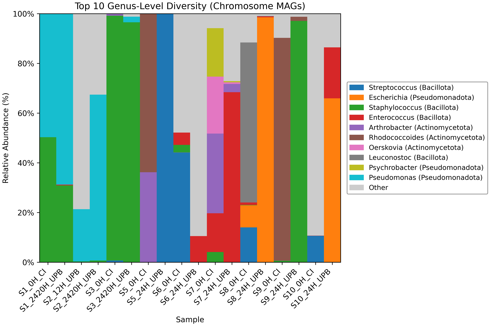
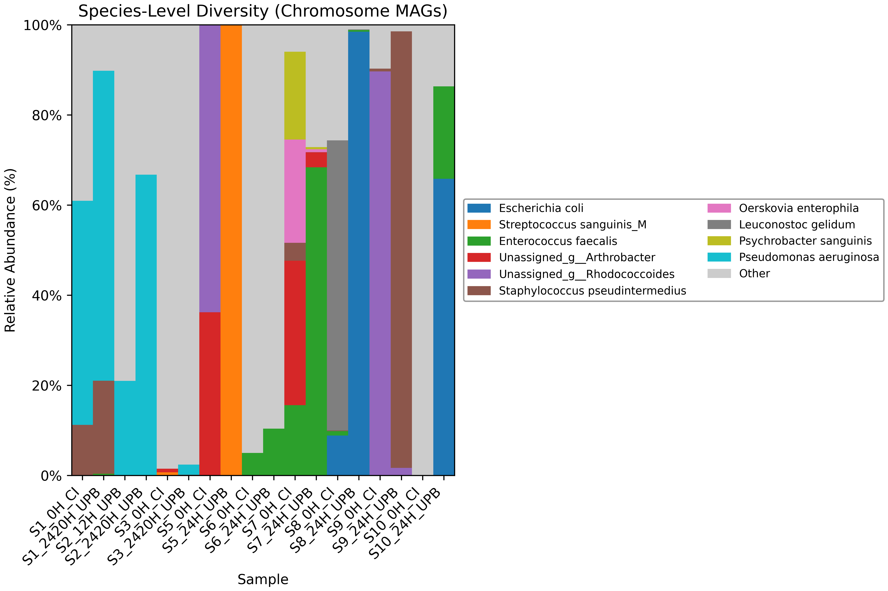
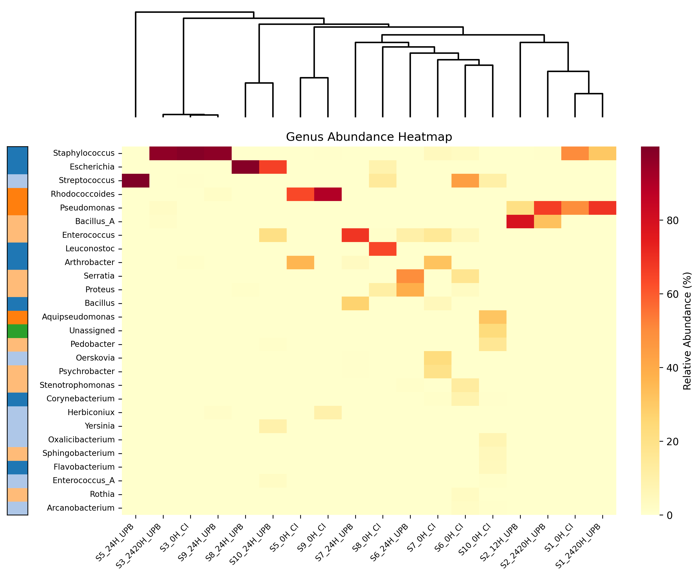
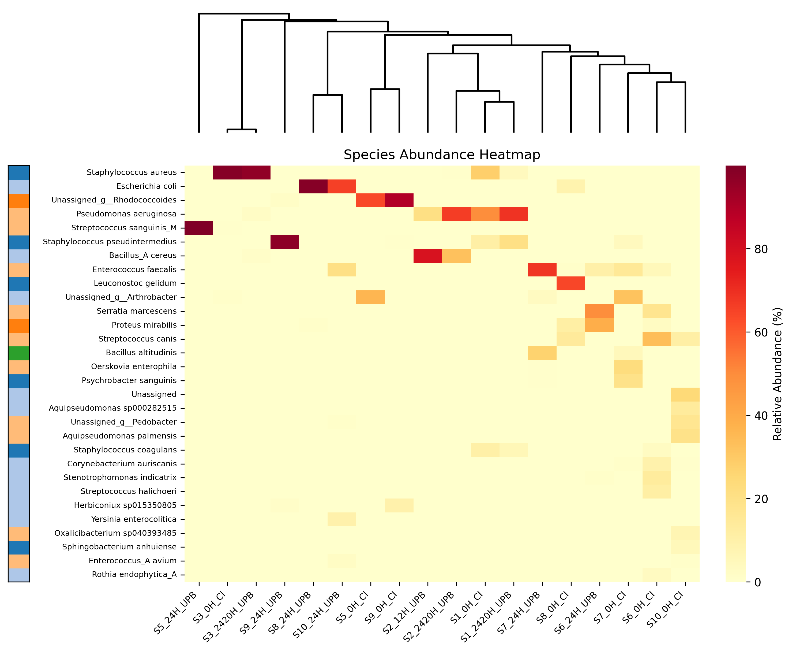
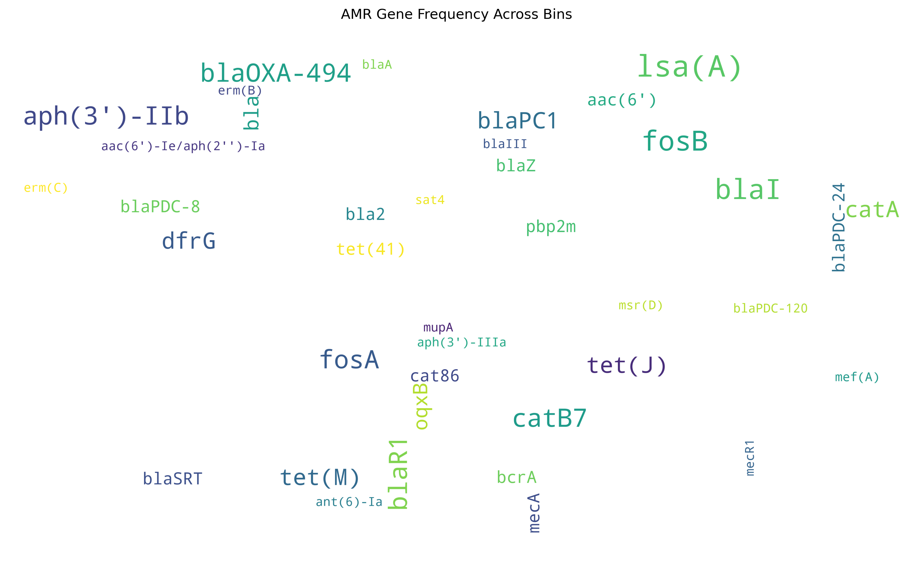
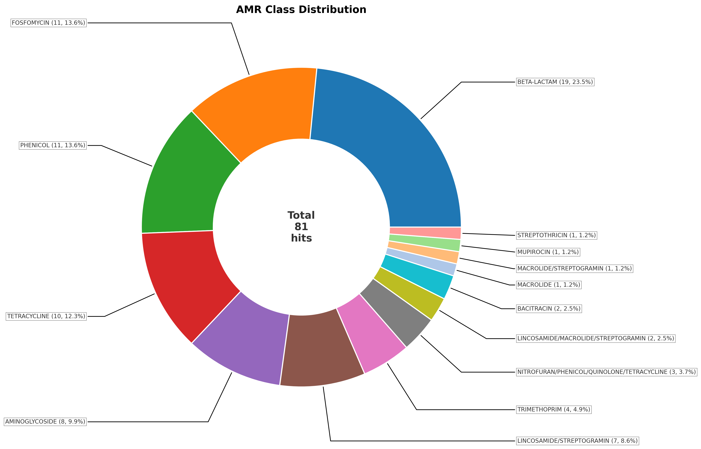
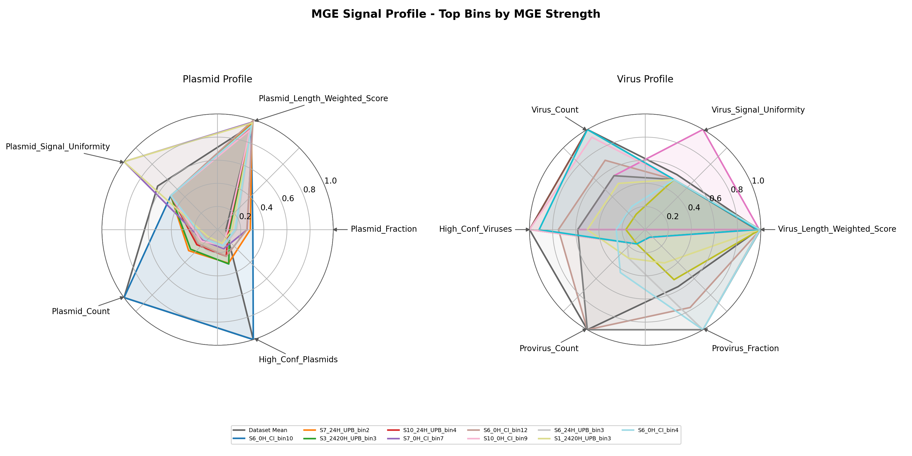

Publication quality plots generated by [**`maggic-wand`**](https://pypi.org/project/maggic-wand) for MAG and bin quality assessment, taxonomic diversity, and AMR/MGE profiling. All plots appear in the `MultiQC` report under the **MAGGIC Plots** section.

## Quality Assessment

### Quality Scatter

Completeness vs contamination scatter plot for all MAGs.

### Quality ECDF

Empirical cumulative distribution of MAG quality metrics.

### Completeness vs Contig Count

Scatter of completeness against number of contigs per bin.

## Taxonomic Diversity

### Genus Diversity

Genus-level taxonomic composition across all MAGs.

### Species Diversity

Species-level taxonomic composition across all MAGs.

### Genus Heatmap

Genus-level taxonomic abundance heatmap.

### Species Heatmap

Species-level taxonomic abundance heatmap.

## AMR Profiling

### AMR Wordcloud

Word cloud of detected AMR gene symbols, sized by frequency.

### AMR Class Distribution

Donut chart of AMR classes across all bins.

## Mobile Genetic Elements

### MGE Radar

Radar chart of mobile genetic element signals (plasmid, virus, provirus, conjugation) across bins.

