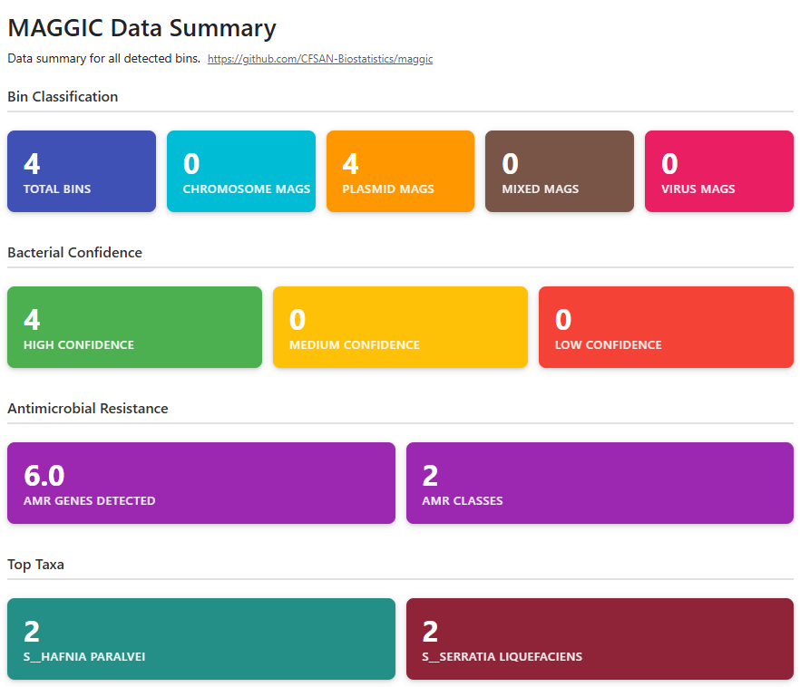

The primary outputs are produced by [`bin/maggic_results.py`](../bin/maggic_results.py), which aggregates quality metrics, taxonomic classification, mobile genetic element detection, and AMR profiling from all binning tools into structured results.

## `MultiQC` HTML Report

MAGGIC generates an interactive `MultiQC` HTML report consolidating all pipeline outputs into a single browsable file.

The **Data Summary** cards provide a quick overview:

- **Bin Classification**: Total bins detected, breakdown by bin type (Chromosome, Plasmid, Mixed, Virus MAGs)
- **Bacterial Confidence**: High/Medium/Low confidence bins based on `CheckM2` quality thresholds
- **Antimicrobial Resistance**: Total AMR genes detected and unique AMR classes
- **Top 10 Taxa**: Most abundant genera across all bins

The report includes the following sections:

- **Chromosome Table**: Sortable `Chromosome_MAG` rows (see [[Bin-Classification]])
- **Plasmid Table**: Sortable `Plasmid_MAG` and `Mixed_MAG` rows (see [[Plasmid-Virus-Metrics]])
- **Virus Table**: Sortable `Virus_MAG` rows (see [[Plasmid-Virus-Metrics]])
- **Sequence Quality Reports**: Read quality from `fastp` or `filtlong`
- **MAGGIC Plots**: Diagnostic plots from `maggic-wand` (see [[MAGGIC-Plots]])

## Output Files (`maggic_results` folder)

| File | Description |
|------|-------------|
| `maggic-results.tsv` | Full 30-column results table (all bins, all columns) |
| `maggic-results-chromosome.tsv` | `Chromosome_MAG` bins only (15 columns) |
| `maggic-results-plasmid.tsv` | `Plasmid_MAG` and `Mixed_MAG` bins (21 columns) |
| `maggic-results-virus.tsv` | `Virus_MAG` bins only (14 columns) |
| `maggic-globalabundance.tsv` | Merged `CoverM` coverage matrix (rows=bins, columns=samples) |

Each table excludes irrelevant columns so you see only fields appropriate for that bin type.

## Column Reference

| Column | Source | Calculation |
|--------|--------|-------------|
| `Name` | `MAGGIC` bin name | Bin identifier from `Binette` quality report |
| `Bacterial_Confidence` | `MAGGIC` | Assigned based on quality and taxonomy thresholds (see [[Bin-Classification]]) |
| `Taxonomy` | `GTDB-Tk` `classify_wf` | Full GTDB taxonomy string from release232 classification |
| `Completeness` | `Binette` quality report | `CheckM2` completion percentage |
| `Contamination` | `Binette` quality report | `CheckM2` contamination percentage |
| `Closest_Ref_ANI` | `GTDB-Tk` | Average nucleotide identity to closest reference genome |
| `Closest_Ref_AF` | `GTDB-Tk` | Alignment fraction to closest reference genome |
| `Genome_Size` | `Binette` quality report | Total bin length in base pairs |
| `Total_Contigs` | `Binette` quality report | Number of contigs in the bin |
| `GC_Content` | Not implemented yet in `MAGGIC` | NA (placeholder value) |
| `N50` | `Binette` quality report | Contig N50 |
| `Coding_Density` | `Binette` quality report | Fraction of bin annotated as coding |
| `Plasmid_Fraction` | `Binette` quality report + `geNomad` `plasmid_summary.tsv` | Fraction of total contigs with plasmid_score >= 0.75 (uses `Binette` contig_count as denominator, not `plasmid_summary.tsv` row count) |
| `Plasmid_Length_Weighted_Score` | `geNomad` `plasmid_summary.tsv` | Length-weighted mean plasmid_score: `sum(score_i * length_i) / sum(length_i)`. Falls back to simple mean if lengths unavailable. `PlasMAAG` approach (<a href="https://pubmed.ncbi.nlm.nih.gov/41639269/" target="_blank">Lindez *et al*. 2026</a>). In plasmid TSV output, column is renamed to `Length_Weighted_Score` |
| `Virus_Length_Weighted_Score` | `geNomad` `virus_summary.tsv` | Length-weighted mean virus_score: `sum(score_i * length_i) / sum(length_i)`. Falls back to simple mean if lengths unavailable. In virus TSV output, column is renamed to `Length_Weighted_Score` |
| `Plasmid_Signal_Uniformity` | `geNomad` `plasmid_summary.tsv` | How uniform the plasmid signal is across contigs. High if length-weighted score >= 0.9 AND min score >= 0.8; Medium if length-weighted score >= 0.7 AND min score >= 0.5; Low otherwise (see [[Plasmid-Virus-Metrics]]) |
| `Virus_Count` | `geNomad` `virus_summary.tsv` | Number of viral/viral-like contigs (phages, proviruses, other MGEs) |
| `High_Conf_Viruses` | `geNomad` `virus_summary.tsv` | Contigs with virus_score >= 0.9 AND FDR <= 10% |
| `Virus_Signal_Uniformity` | `geNomad` `virus_summary.tsv` | How uniform the viral signal is across contigs. High if length-weighted score >= 0.9 AND min score >= 0.8 AND no proviruses; Medium if proviruses present with high scores, or length-weighted score >= 0.7 AND min score >= 0.5; Low otherwise. Proviruses (integrated prophages) reduce confidence from High to Medium (<a href="https://doi.org/10.1038/s41587-023-01953-y" target="_blank">Camargo *et al*. 2024</a>) |
| `Provirus_Count` | `geNomad` `virus_summary.tsv` | Contigs with topology == `Provirus`; potentially physically integrated into the bin |
| `Provirus_Fraction` | `geNomad` `virus_summary.tsv` | `provirus_count / virus_count` |
| `Mobility_Potential` | `MAGGIC` | Pipe-separated evidence summary: `plasmid:High\|virus:Low\|proviruses:2\|mob:Relaxed,Mobilized` where `mob` types come from `geNomad` plasmid_summary.tsv. Components appended only if present; `none` if no MGE evidence |
| `Virus_Taxonomy` | `geNomad` `virus_summary.tsv` | Semicolon-separated unique virus taxonomy strings |
| `Plasmid_Count` | `geNomad` `plasmid_summary.tsv` | Number of plasmid contigs |
| `High_Conf_Plasmids` | `geNomad` `plasmid_summary.tsv` | Contigs with plasmid_score >= 0.9 AND FDR <= 10% |
| `Conjugation_Genes` | `geNomad` `plasmid_summary.tsv` | Semicolon-separated mobilization gene types |
| `AMR_Gene_Count` | `AMRFinderPlus` | Number of hits with Type == "AMR" or Type == "STRESS" (excludes DISINFECTANT, HEAVY_METAL) |
| `AMR_Classes` | `AMRFinderPlus` | Semicolon-separated unique AMR classes |
| `AMR_Genes` | `AMRFinderPlus` | Semicolon-separated unique gene symbols |
