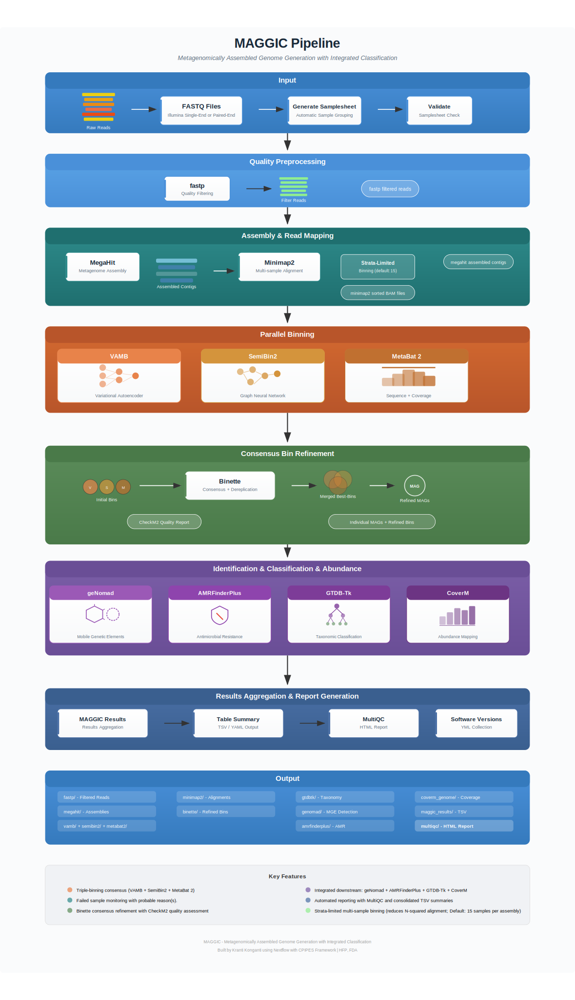

# maggic

`maggic` (**M**etagenomically **A**ssembled **G**enome **G**eneration with **I**ntegrated **C**lassification) is an automated workflow for the generation and refinement of Metagenome-Assembled Genomes (**MAGs**) from metagenomic sequencing data. It integrates multiple binning algorithms (**VAMB**, **SemiBin2**, **MetaBat 2**) followed by consensus-based bin refinement with **Binette**, taxonomic classification with **GTDB-Tk**, mobile genetic element detection with **geNomad**, and antimicrobial resistance gene profiling with **AMRFinderPlus**.

\
&nbsp;

<!-- TOC -->

- [Minimum Requirements](#minimum-requirements)
- [Database Requirements](#database-requirements)
- [Pipeline Overview](#pipeline-overview)
- [Multi-Sample Binning with Strata Control](#multi-sample-binning-with-strata-control)
- [MAGGIC Results](#maggic-results)
- [Usage and Examples](#usage-and-examples)
  - [Input](#input)
  - [Output](#output)
  - [Computational resources](#computational-resources)
  - [Runtime profiles](#runtime-profiles)
  - [your_institution.config](#your_institutionconfig)
  - [Cloud computing](#cloud-computing)
- [Future Roadmap](#future-roadmap)
- [maggic CLI Help](#maggic-cli-help)

<!-- /TOC -->

\
&nbsp;

## Minimum Requirements

1. [Nextflow version 25.10.5](https://github.com/nextflow-io/nextflow/releases/download/v25.10.5/nextflow).
    - Make the `nextflow` binary executable (`chmod 755 nextflow`) and also make sure that it is made available in your `$PATH`.
    - If your existing `JAVA` install does not support the newest **Nextflow** version, you can use **Amazon**'s `JAVA` (OpenJDK): [Corretto](https://docs.aws.amazon.com/corretto/latest/corretto-21-ug/downloads-list.html).
2. Either of `micromamba`, `docker`, `singularity`, or `apptainer` installed and available in your `$PATH`.
    - To install `micromamba` for your system type, please follow these [installation steps](https://mamba.readthedocs.io/en/latest/installation/micromamba-installation.html#linux-and-macos) and make sure that the `micromamba` binary is available in your `$PATH`.
    - Just the `curl` step is sufficient to download the binary as far as running the workflows are concerned.
    - Once you have finished the installation, **it is important that you upgrade `micromamba` to at least version `2.3.2` or greater**.

    ```bash
    micromamba --version
    micromamba self-update -c conda-forge
    ```

3. **Please Note**: Due to testing priority, only container (`apptainer`, `singularity`) based workflow has been fully validated. Please [report any issues via GitHub](https://github.com/CFSAN-Biostatistics/MAGGIC/issues) if you encounter any failures.
4. Minimum of 20 CPU cores and 128 GB of memory for all workflow steps.

\
&nbsp;

## Database Requirements

**The following databases are required before running the pipeline. All paths must be provided via command-line options or configuration files**:

- **GTDB-Tk reference database** (`--gtdbtk_classify_wf_data_path`): Used for taxonomic classification of **MAGs**.
- **CheckM2 database** (`--binette_checkm2_db`): Used by **Binette** for bin quality assessment.
- **geNomad database** (`--genomad_db`): Used for viral and plasmid element detection.
- **AMRFinderPlus database** (`--amrfinderplus_db`): Used for antimicrobial resistance gene profiling.
- For the sake of simplicity and ease of use, you can download all of them from [research.foodsafetyrisk.org](https://research.foodsafetyrisk.org/maggic/dbs/maggic_dbs.tar.bz2).
- Once you have downloaded the databases, uncompress the archive and set the UNIX paths in the configuration file as follows:
  - [Line 137](../workflows/conf/maggic.config#L137): `binette_checkm2_db = /path/to/maggic_dbs/checkm2/latest`
  - [Line 206](../workflows/conf/maggic.config#L206): `gtdbtk_classify_wf_data_path = /path/to/gtdbtk/release232`
  - [Line 216](../workflows/conf/maggic.config#L216): `genomad_db = /path/to/maggic_dbs/genomad/latest/genomad_db`
  - [Line 218](../workflows/conf/maggic.config#L218): `amrfinderplus_db = /path/to/maggic_dbs/amrfinderplus/latest`

**Setting the database paths in the configuration file is the recommended approach as it avoids having to specify them via CLI options on every pipeline run**.

\
&nbsp;

## Pipeline Overview



\
&nbsp;

## Multi-Sample Binning with Strata Control

MAGGIC implements **strata-limited multi-sample binning**, a computationally efficient approach that improves **MAG** recovery while keeping alignment counts tractable for large cohorts.

Multi-sample binning works by aligning reads from multiple samples against every assembled contig set, providing binning tools (**VAMB**, **SemiBin2**, **MetaBat 2**) with cross-sample coverage profiles. As shown by <a href="https://doi.org/10.1038/s41467-025-57957-6" target="_blank">Han <em>et al</em>. 2025</a>, this approach recovers **41-43% more species and strains** compared to single-sample binning, including rare taxa and antibiotic resistance gene hosts.

However, traditional all-vs-all alignment produces N² BAM files (50 samples = 2,500 alignments; 100 samples = 10,000 alignments), which quickly becomes computationally intractable. Coverage diversity **saturates around 20-30 samples** for most metagenomic experiments; beyond that, marginal improvement occurs at exponentially increasing computational cost (<a href="https://doi.org/10.1038/s41467-025-57957-6" target="_blank">Han <em>et al</em>. 2025</a>; <a href="https://doi.org/10.1038/s41587-020-00777-4" target="_blank">Nissen <em>et al</em>. 2021</a>; <a href="https://doi.org/10.3389/fmicb.2022.869135" target="_blank">Haryono <em>et al</em>. 2022</a>).

### How It Works

MAGGIC selects a subset of `strata_size` samples (default 15) and aligns their reads to every assembly, producing `strata_size × N` BAM files instead of N². The selection uses **staggered sampling**, which distributes the selected samples uniformly across the full sorted sample list. This avoids the geographic selection bias introduced by `MAGGIC` `v0.3.0`'s first-N sequential selection. For example, in runs where sample IDs encode spatial information (state prefixes, site codes, collection dates), taking the first N samples concentrates coverage from a single region. Since geographic distance is the primary driver of beta diversity in environmental samples (<a href="https://doi.org/10.1038/s41467-024-55425-1" target="_blank">Cheng <em>et al</em>. 2024</a>; <a href="https://doi.org/10.1128/mbio.02844-24" target="_blank">Peng <em>et al</em>. 2025</a>), coverage profiles from a clustered subset distort the co-abundance patterns that binning algorithms learn.

For example, with 500 samples and `strata_size` = 15:

| Method | Selected indices | Geographic spread |
|--------|-----------------|-------------------|
| First-N (sequential) | 0, 1, 2, 3, ... 14 | 1-2 states if IDs are alphabetically ordered by geography |
| Staggered intervals | 0, 33, 66, 99, ... 483 | ~15 states evenly distributed |

The selected strata samples may potentially represent the full cohort diversity, which matters because the binning algorithms (VAMB's variational autoencoder, MetaBAT 2's coverage clustering, SemiBin2's graph neural network) learn from these co-abundance patterns (<a href="https://doi.org/10.1038/s41587-020-00777-4" target="_blank">Nissen <em>et al</em>. 2021</a>; <a href="https://doi.org/10.1038/s41467-025-57957-6" target="_blank">Han <em>et al</em>. 2025</a>).

The approach is controlled by two parameters:

| Parameter | Default | Description |
|-----------|---------|-------------|
| `--multi_sample_strata` | `true` | Enable strata-limited mode (`true` by default. Set `false` for full all-vs-all) |
| `--strata_size` | `15` | Number of samples whose reads are aligned to each assembly |

### Computational Time

| Samples | Full All-vs-All | Strata (15) | `MAGGIC` Computational Time Reduction |
|---------|----------------|-------------|-----------|
| 30 | 900 BAMs | 450 BAMs | 2x |
| 50 | 2,500 BAMs | 750 BAMs | 3.3x |
| 100 | 10,000 BAMs | 1,500 BAMs | 6.7x |
| 200 | 40,000 BAMs | 3,000 BAMs | 13.3x |
| 500 | 250,000 BAMs | 7,500 BAMs | 33.3x |

The strata size of 15 is the default because it balances cross-sample coverage diversity with compute cost. For highly diverse cohorts (e.g., environmental samples from disparate locations), increase `--strata_size` to 20-30. For homogeneous cohorts (e.g., clinical samples from the same body site), 10-15 is sufficient.

```bash
./cpipes \
    --pipeline maggic \
    --input /path/to/fastq/dir \
    --output /path/to/output \
    --strata_size 20 \
    -profile singularity \
    -resume
```

\
&nbsp;

## MAGGIC Results

The primary outputs of the `MAGGIC` pipeline are produced by [bin/maggic_results.py](../bin/maggic_results.py), which aggregates quality metrics, taxonomic classification, mobile genetic element detection, and AMR profiling from all binning tools into a set of structured results.

### MultiQC HTML Report

The `MAGGIC` pipeline generates an interactive **MultiQC HTML report** that consolidates all pipeline outputs into a single browsable file.

Example:


The **Data Summary** cards provide a quick overview:

- **Bin Classification**: Total bins detected, and breakdown by bin type (Chromosome, Plasmid, Mixed, Virus MAGs)
- **Bacterial Confidence**: High/Medium/Low confidence bins based on `CheckM2` quality thresholds
- **Antimicrobial Resistance**: Total AMR genes detected and unique AMR classes
- **Top 10 Taxa**: Most abundant genera across all bins

The rest of the report is rendered with the following main results' sections:

- **Chromosome Table**: Sortable `Chromosome_MAG` rows.
- **Plasmid Table**: Sortable `Plasmid_MAG` and `Mixed_MAG` rows.
- **Virus Table**: Sortable `Virus_MAG` rows.
- **Sequence Quality Reports**: Your reads' quality reports from `fastp` or `filtlong` (`filtlong` not implemented yet).

### Output Files (`maggic_results` folder)

`maggic_results.py` produces the following files:

| File | Description |
|------|-------------|
| `maggic-results.tsv` | Full 30-column results table (all bins, all columns) |
| `maggic-results-chromosome.tsv` | `Chromosome_MAG` bins only, with chromosome-relevant columns (15 columns) |
| `maggic-results-plasmid.tsv` | `Plasmid_MAG` and `Mixed_MAG` bins, with plasmid-relevant columns (21 columns) |
| `maggic-results-virus.tsv` | `Virus_MAG` bins only, with virus-relevant columns (14 columns) |
| `maggic-globalabundance.tsv` | Merged `CoverM` coverage matrix (rows=bins, columns=samples) |

Each results' table excludes irrelevant columns so that you can see only the fields appropriate for that bin type.

| Column | Source | Calculation |
|--------|--------|-------------|
| `Name` | `MAGGIC` bin name | Bin identifier from `Binette` quality report |
| `Bacterial_Confidence` | `MAGGIC` | Assigned based on quality and taxonomy thresholds (see [Bacterial_Confidence Thresholds](#bacterial_confidence-thresholds)) |
| `Taxonomy` | `GTDB-Tk` `classify_wf` | Full GTDB taxonomy string from `release232` classification |
| `Completeness` | `Binette` quality report | `CheckM2` completion percentage |
| `Contamination` | `Binette` quality report | `CheckM2` contamination percentage |
| `Closest_Ref_ANI` | `GTDB-Tk` | Average nucleotide identity to closest reference genome |
| `Closest_Ref_AF` | `GTDB-Tk` | Alignment fraction to closest reference genome |
| `Genome_Size` | `Binette` quality report | Total bin length in base pairs |
| `Total_Contigs` | `Binette` quality report | Number of contigs in the bin |
| `GC_Content` | Not implemented yet in `MAGGIC` | `NA` (placeholder value) |
| `N50` | `Binette` quality report | Contig N50 |
| `Coding_Density` | `Binette` quality report | Fraction of bin annotated as coding |
| `Plasmid_Fraction` | `Binette` quality report + `geNomad` `plasmid_summary.tsv` | Fraction of total contigs with plasmid_score >= 0.75 (uses `Binette` contig_count as denominator, not `plasmid_summary.tsv` row count) |
| `Plasmid_Length_Weighted_Score` | `geNomad` `plasmid_summary.tsv` | Length-weighted mean plasmid_score: `sum(score_i * length_i) / sum(length_i)`. Falls back to simple mean if lengths unavailable. `PlasMAAG` approach (<a href="https://pubmed.ncbi.nlm.nih.gov/41639269/" target="_blank">Lindez <em>et al</em>. 2026</a>). In plasmid TSV output, column is renamed to `Length_Weighted_Score` |
| `Virus_Length_Weighted_Score` | `geNomad` `virus_summary.tsv` | Length-weighted mean virus_score: `sum(score_i * length_i) / sum(length_i)`. Falls back to simple mean if lengths unavailable. In virus TSV output, column is renamed to `Length_Weighted_Score` |
| `Plasmid_Signal_Uniformity` | `geNomad` `plasmid_summary.tsv` | How uniform the plasmid signal is across contigs. High if length-weighted score >= 0.9 AND min score >= 0.8; Medium if length-weighted score >= 0.7 AND min score >= 0.5; Low otherwise |
| `Virus_Count` | `geNomad` `virus_summary.tsv` | Number of viral/viral-like contigs (phages, proviruses, other MGEs) |
| `High_Conf_Viruses` | `geNomad` `virus_summary.tsv` | Contigs with virus_score >= 0.9 AND FDR <= 10% |
| `Virus_Signal_Uniformity` | `geNomad` `virus_summary.tsv` | How uniform the viral signal is across contigs. High if length-weighted score >= 0.9 AND min score >= 0.8 AND no proviruses; Medium if proviruses present with high scores, or length-weighted score >= 0.7 AND min score >= 0.5; Low otherwise. Proviruses (integrated prophages) reduce confidence from High to Medium (<a href="https://doi.org/10.1038/s41587-023-01953-y" target="_blank">Camargo <em>et al</em>. 2024</a>) |
| `Provirus_Count` | `geNomad` `virus_summary.tsv` | Contigs with topology == `Provirus`; potentially physically integrated into the bin |
| `Provirus_Fraction` | `geNomad` `virus_summary.tsv` | `provirus_count / virus_count` |
| `Mobility_Potential` | `MAGGIC` | Pipe-separated evidence summary: `plasmid:High\|virus:Low\|proviruses:2\|mob:Relaxed,Mobilized` where `mob` types come from `geNomad` `plasmid_summary.tsv`. Components appended only if present; `none` if no MGE evidence |
| `Virus_Taxonomy` | `geNomad` `virus_summary.tsv` | Semicolon-separated unique virus taxonomy strings |
| `Plasmid_Count` | `geNomad` `plasmid_summary.tsv` | Number of plasmid contigs |
| `High_Conf_Plasmids` | `geNomad` `plasmid_summary.tsv` | Contigs with plasmid_score >= 0.9 AND FDR <= 10% |
| `Conjugation_Genes` | `geNomad` `plasmid_summary.tsv` | Semicolon-separated mobilization gene types |
| `AMR_Gene_Count` | `AMRFinderPlus` | Number of hits with Type == "AMR" or Type == "STRESS" (excludes DISINFECTANT, HEAVY_METAL) |
| `AMR_Classes` | `AMRFinderPlus` | Semicolon-separated unique AMR classes |
| `AMR_Genes` | `AMRFinderPlus` | Semicolon-separated unique gene symbols |

### `MAGGIC` Bacterial_Confidence Thresholds

| Level | Completeness | Contamination | ANI | AF |
|-------|-------------|---------------|-----|----|
| **High** | >= 90% | < 5% | >= 95% | >= 0.65 |
| **Medium** | >= 50% | < 10% | >= 80% | >= 0.50 |
| **Low** | below Medium thresholds | | | |

Thresholds are configurable via CLI options (`--high-comp`, `--high-contam`, `--high-ani`, `--high-af`, `--med-comp`, `--med-contam`, `--med-ani`, `--med-af`).

### `MAGGIC` Bin_Type Classification

Bins are classified using a multi-signal approach within `MAGGIC` based on `geNomad` reported scores, with a biologically grounded completeness filter.

**geNomad plasmid classification**: Precision of 70.8% (<a href="https://doi.org/10.1038/s41587-023-01953-y" target="_blank">Camargo <em>et al</em>. 2024</a>), meaning nearly one third of contigs called plasmid are potentially false positives. Sensitivity is 89.8%. In contrast, `geNomad` virus classification is strong (MCC 95.3%, F1 97.3%). **geNomad runs in default mode** so that ALL contigs receive plasmid/virus scores, where possible, which are required for `Plasmid_Signal_Uniformity` calculations. `geNomad`'s official filtering presets: default (min-score=0.70), conservative (min-score=0.80), and relaxed (min-score=0.00).

**Note: geNomad output files contain only positive predictions.** The `virus_summary.tsv` contains only contigs detected as viral (proviruses, virions), and `plasmid_summary.tsv` contains only contigs detected as plasmid. Contigs not flagged as viral or plasmid do not appear in these files. Therefore, the completeness filter against `CheckM2` markers is the only discriminator.

**`MAGGIC` Hard Completeness Filter (completeness >= 50%):** This filter is based on the biology of how completeness is measured. `MAGGIC` uses `CheckM2` for completeness estimates (via `Binette`). `CheckM2` uses ~20,000 KEGG orthologs for chromosomal housekeeping functions (metabolism, DNA replication, transcription, etc.; <a href="https://doi.org/10.1038/s41592-023-02017-3" target="_blank">Chklovski <em>et al</em>. 2023</a>), plus machine learning models trained on chromosomal MAGs. Plasmids and viruses typically do not carry these chromosomal markers. Therefore, a bin with completeness >= 50% likely contains chromosomal DNA and `MAGGIC` does not classify it as a pure `Plasmid_MAG` or `Virus_MAG`:

| `MAGGIC` Classification | When completeness >= 50% |
|---------------|-----------|
| `Mixed_MAG` | `geNomad` `plasmid_summary.tsv` has contigs with plasmid_score >= 0.75 AND count of those contigs / total_contigs >= 0.2 (using `Binette` contig_count as denominator), meaning chromosomal DNA with substantial plasmid content |
| `Chromosome_MAG` | No contigs with plasmid_score >= 0.75, OR plasmid_fraction < 0.2. Also assigned when `virus_summary.tsv` exists but only proviruses are present (no plasmid signal); proviruses are common in bacterial chromosomes and do not trigger `Virus_MAG` |
| `Plasmid_MAG` | Not assigned when completeness >= 50% |
| `Virus_MAG` | Not assigned when completeness >= 50% |

| `MAGGIC` Classification | When completeness < 50% |
|---------------|-----------|
| `Virus_MAG` | geNomad `virus_summary.tsv` has any entries (checked first, since virus model is most reliable at MCC 95.3%) |
| `Plasmid_MAG` | geNomad `plasmid_summary.tsv` has any entries but virus_summary.tsv has none |
| `Chromosome_MAG` | neither geNomad plasmid nor virus summaries have entries |

This classification results in split output tables and determines which table in the **MultiQC** report each bin appears in.

### `MAGGIC` Plasmid_Signal_Uniformity

This metric measures how uniformly the plasmid signal is distributed across all contigs in a bin. It uses same scoring as `PlasMAAG` (<a href="https://pubmed.ncbi.nlm.nih.gov/41639269/" target="_blank">Lindez <em>et al</em>. 2026</a>): a length-weighted mean of `plasmid_score` across contigs, combined with the minimum score.

| Level | Length-Weighted Score | Minimum Score |
|-------|----------------------|---------------|
| **High** | >= 0.9 | >= 0.8 |
| **Medium** | >= 0.7 | >= 0.5 |
| **Low** | below Medium thresholds | |

**High** uniformity suggests all contigs carry a strong plasmid signal, consistent with a single replicon without chromosomal contamination.

### `MAGGIC` Virus_Signal_Uniformity

Analogous to `Plasmid_Signal_Uniformity`, but for viral contigs. A key difference: **proviruses reduce confidence**. An integrated prophage within a chromosomal bin produces a less informative viral signal than a standalone virus (<a href="https://doi.org/10.1038/s41587-023-01953-y" target="_blank">Camargo <em>et al</em>. 2024</a>).

| Level | Length-Weighted Score | Minimum Score | Proviruses |
|-------|----------------------|---------------|------------|
| **High** | >= 0.9 | >= 0.8 | None |
| **Medium** | High scores with proviruses present (even if >= 0.9/0.8), OR moderate signal (>= 0.7/0.5) | | Any |
| **Low** | below Medium thresholds | | Any |

\
&nbsp;

## Usage and Examples

Clone or download this repository and then call `cpipes`.

```bash
./cpipes --pipeline maggic [options]
```

Alternatively, you can use `nextflow` to directly pull and run the pipeline.

```bash
nextflow pull CFSAN-Biostatistics/maggic
nextflow list
nextflow info CFSAN-Biostatistics/maggic
nextflow run CFSAN-Biostatistics/maggic --pipeline maggic --help
```

\
&nbsp;

**Example**: Run the default `maggic` pipeline.

```bash
cd /data/scratch/$USER
mkdir nf-maggic
cd nf-maggic
./cpipes \
    --pipeline maggic \
    --input /path/to/illumina/fastq/dir \
    --output /path/to/output \
    -profile singularity \
    -resume
```

\
&nbsp;

**Example**: Run the `maggic` pipeline in single-end mode.

```bash
cd /data/scratch/$USER
mkdir nf-maggic
cd nf-maggic
./cpipes \
    --pipeline maggic \
    --input /path/to/illumina/fastq/dir \
    --output /path/to/output \
    --fq_single_end true \
    --fq_filename_delim_idx 4 \
    -profile singularity \
    -resume
```

\
&nbsp;

### Input

---

The input to the workflow is a folder containing compressed (`.gz`) FASTQ files. The sample grouping happens automatically by the file name of the FASTQ file. If, for example, a single sample is sequenced across multiple sequencing lanes, you can group those FASTQ files into one sample by using the `--fq_filename_delim` and `--fq_filename_delim_idx` options. By default, `--fq_filename_delim` is set to `_` (underscore) and `--fq_filename_delim_idx` is set to 1.

For example, if the directory contains FASTQ files as shown below:

- KB-01_apple_L001_R1.fastq.gz
- KB-01_apple_L001_R2.fastq.gz
- KB-01_apple_L002_R1.fastq.gz
- KB-01_apple_L002_R2.fastq.gz
- KB-02_mango_L001_R1.fastq.gz
- KB-02_mango_L001_R2.fastq.gz
- KB-02_mango_L002_R1.fastq.gz
- KB-02_mango_L002_R2.fastq.gz

Then, to create 2 sample groups, `apple` and `mango`, split the file name by the delimiter (underscore by default) and group by the first 2 words (`--fq_filename_delim_idx 2`).

All FASTQ files should have uniform naming patterns so that `--fq_filename_delim` and `--fq_filename_delim_idx` options do not have any adverse effect in collecting and creating a sample metadata sheet.

\
&nbsp;

### Output

---

All outputs for each step are stored inside the folder mentioned with the `--output` option. A `CPIPES-Report_multiqc_report.html` file inside the `maggic-multiqc` folder can be opened in any browser on your local workstation and contains a consolidated report.

**Output directory structure:**

| Directory | Description |
|-----------|-------------|
| `fastp/` | Quality filtered FASTQ files and JSON reports |
| `megahit/` | Metagenome assemblies (FASTA contigs) |
| `minimap2/` | Alignment BAM files |
| `vamb/` | **VAMB** binning output |
| `semibin2/` | **SemiBin2** binning output |
| `metabat2/` | **MetaBat 2** binning output |
| `binette/` | Consensus refined bins and quality reports |
| `gtdbtk/` | Taxonomic classification results |
| `genomad/` | Virus and plasmid detection results |
| `amrfinderplus/` | AMR gene detection results |
| `coverm_genome/` | Abundance/coverage tables |
| `maggic_results/` | Aggregated results TSVs |
| `table_summary/` | Summary tables |
| `maggic-multiqc/` | **MultiQC** HTML report |

\
&nbsp;

### Computational resources

---

Majority of the pipeline processes are configured with the `process_low_turbo` resource label, which requires a minimum of **20 CPU cores** and **128 GB of memory** per task. By default, `maggic` uses 10 CPU cores where possible. You can change this behavior and adjust the CPU cores with `--max_cpus` option.

\
&nbsp;

Example:

```bash
./cpipes \
    --pipeline maggic \
    --input /path/to/metagenomic_fastq/dir \
    --output /path/to/output \
    --max_cpus 5 \
    -profile singularity \
    -resume
```

\
&nbsp;

### Runtime profiles

---

You can use different runtime profiles that suit your specific compute environments i.e., you can run the workflow locally on your machine or in a grid computing infrastructure.

\
&nbsp;

Example:

```bash
cd /data/scratch/$USER
mkdir nf-maggic
cd nf-maggic
./cpipes \
    --pipeline maggic \
    --input /path/to/fastq_pass_dir \
    --output /path/to/where/output/should/go \
    -profile your_institution
```

The above command would run the pipeline and store the output at the location per the `--output` flag and the **Nextflow** reports are always stored in the current working directory from where `cpipes` is run. For example, for the above command, a directory called `CPIPES-maggic` would hold all the **Nextflow** related logs, reports and trace files.

\
&nbsp;

### `your_institution.config`

---

In the above example, we have mentioned the runtime profile as `your_institution`. For this to work, add the following lines at the end of [`computeinfra.config`](../conf/computeinfra.config) file which should be located inside the `conf` folder. For example, if your institution uses **SGE** or **UNIVA** for grid computing instead of **SLURM** and has a job queue named `normal.q`, then add these lines:

\
&nbsp;

```groovy
your_institution {
    process.executor = 'sge'
    process.queue = 'normal.q'
    singularity.enabled = false
    singularity.autoMounts = true
    docker.enabled = false
    params.enable_conda = true
    conda.enabled = true
    conda.useMicromamba = true
    params.enable_module = false
}
```

In the above example, by default, all the software provisioning choices are disabled except `conda`. You can also choose to remove the `process.queue` line altogether and the `maggic` workflow will request the appropriate memory and number of CPU cores automatically.

\
&nbsp;

### Cloud computing

---

You can run the workflow in the cloud (works only with proper set up of AWS resources). Add new runtime profiles with required parameters per [Nextflow docs](https://www.nextflow.io/docs/latest/executor.html):

\
&nbsp;

Example:

```groovy
my_aws_batch {
    executor = 'awsbatch'
    queue = 'my-batch-queue'
    aws.batch.cliPath = '/home/ec2-user/miniconda/bin/aws'
    aws.batch.region = 'us-east-1'
    singularity.enabled = false
    singularity.autoMounts = true
    docker.enabled = true
    params.conda_enabled = false
    params.enable_module = false
}
```

\
&nbsp;

## Future Roadmap

- 06/04/2026: Will address BAM low depth issues in later versions. <1% mapped && <100K reads && <5000 contigs will be filtered out.

\
&nbsp;

## maggic CLI Help

```bash
[Kranti.Konganti@my-unix-box ]$ ./cpipes --pipeline maggic --help

N E X T F L O W   ~  version 25.10.5

Launching `./cpipes` [distracted_panini] DSL2 - revision: 0a03b0b454

====================================================================================================
             (o)
  ___  _ __   _  _ __    ___  ___
 / __|| '_ \ | || '_ \  / _ \/ __|
| (__ | |_) || || |_) ||  __/\__ \
 \___|| .__/ |_|| .__/  \___||___/
      | |       | |
      |_|       |_|
----------------------------------------------------------------------------------------------------
A collection of modular pipelines at CFSAN, FDA.
----------------------------------------------------------------------------------------------------
Name                                                   : CPIPES
Author                                                 : Kranti.Konganti@fda.hhs.gov
Version                                                : 0.9.0
Center                                                 : CFSAN, FDA.
====================================================================================================

----------------------------------------------------------------------------------------------------
Show configurable CLI options for each tool within maggic
----------------------------------------------------------------------------------------------------
Ex: cpipes --pipeline maggic --help
Ex: cpipes --pipeline maggic --help fastp
Ex: cpipes --pipeline maggic --help fastp,megahit
----------------------------------------------------------------------------------------------------
--help fastp                                           : Show fastp CLI options
--help megahit                                         : Show megahit CLI options
--help minimap2                                        : Show minimap2 CLI options
--help seb                                             : Show SemiBin2 `single_easy_bin` CLI options
--help vamb                                            : Show vamb `bin def` CLI options
--help binette                                         : Show binette CLI options
--help gtdbtk                                          : Show gtdbtk classify_wf CLI options
--help abundance                                       : Show CoverM `genome` CLI options
--help amrfinderplus                                   : Show AMRFinderPlus CLI options
--help metabat2                                        : Show metabat2 CLI options
```
